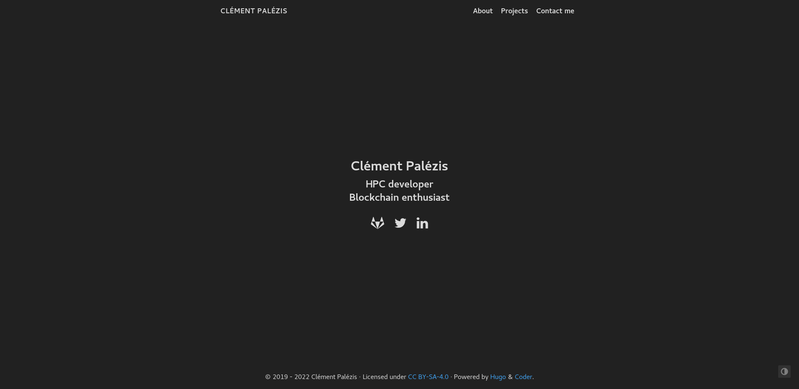

<div id="top"></div>

[![LinkedIn][linkedin-shield]][linkedin-url]
[![Hugo][hugo-shield]][hugo-url]
[![coder][coder-shield]][coder-url]
[![GitLab][gitlab-shield]][gitlab-url]
[![IPFS][IPFS-shield]][IPFS-url]

<br />
<div align="center">
  <a href="https://www.lokhidor.xyz">
    
  </a>

  <h3 align="center">Clément Palézis' personal <a href="https://www.lokhidor.xyz">page</a></h3>
</div>

<!-- TABLE OF CONTENTS -->
<details>
  <summary>Table of Contents</summary>
  <ol>
    <li>
      <a href="#about-the-project">About The Project</a>
      <ul>
        <li><a href="#built-with">Built With</a></li>
      </ul>
    </li>
    <li>
      <a href="#getting-started">Getting Started</a>
      <ul>
        <li><a href="#prerequisites">Prerequisites</a></li>
        <li><a href="#installation">Installation</a></li>
      </ul>
    </li>
    <li><a href="#usage">Usage</a></li>
    <li><a href="#contact">Contact</a></li>
  </ol>
</details>


<!-- ABOUT THE PROJECT -->
## About The Project

A personal website largely inspired by TokenBrice [blog](https://tokenbrice.xyz/f).

Content hosted on [GitLab](https://gitlab.com/Nhkp/website/), rendered by [Hugo](https://gohugo.io/), automatically built and domain handled by [fleek](https://fleek.co/), hosted on [IPFS](https://ipfs.io/).


<p align="right">(<a href="#top">back to top</a>)</p>


### Built With

* [Go](https://go.dev/)
* [Hugo](https://gohugo.io/)

<p align="right">(<a href="#top">back to top</a>)</p>


<!-- GETTING STARTED -->
## Getting Started

### Prerequisites

* Golang >= 1.18
  ```sh
  git clone https://github.com/canha/golang-tools-install-script
  cd golang-tools-install-script
  ./goinstall.sh
  ```

* Hugo >= 0.96
  ```sh
  https://github.com/gohugoio/hugo.git
  cd hugo
  go install
  ```


### Installation

1. Clone the repo
   ```sh
   git clone --recursive https://gitlab.com/Nhkp/website.git
   ```

<p align="right">(<a href="#top">back to top</a>)</p>


<!-- USAGE EXAMPLES -->
## Usage

### Launch

```sh
hugo server
```


<!-- CONTACT -->
## Contact

Clément Palézis - palezis.c@gmail.com

Project Link: [https://gitlab.com/Nhkp/website/](https://gitlab.com/Nhkp/website/)

<p align="right">(<a href="#top">back to top</a>)</p>


<!-- MARKDOWN LINKS & IMAGES -->
<!-- https://www.markdownguide.org/basic-syntax/#reference-style-links -->
[linkedin-shield]: https://img.shields.io/badge/Profile%20on-LinkedIn-0077b5?&logo=linkedin
[linkedin-url]: https://linkedin.com/in/cpalezis

[hugo-shield]: https://img.shields.io/badge/Generator%20is-Hugo-ff4088?&logo=hugo
[hugo-url]: https://github.com/gohugoio/hugo

[coder-shield]: https://img.shields.io/badge/Theme%20is-coder-2a6df4
[coder-url]: https://github.com/luizdepra/hugo-coder

[gitlab-shield]: https://img.shields.io/badge/Source%20on-GitLab-fc6d26?&logo=gitlab
[gitlab-url]: https://gitlab.com/Nhkp/website/

[IPFS-shield]: https://img.shields.io/badge/Hosted%20on-IPFS-65c2cb?&logo=ipfs
[IPFS-url]: https://ipfs.io/
